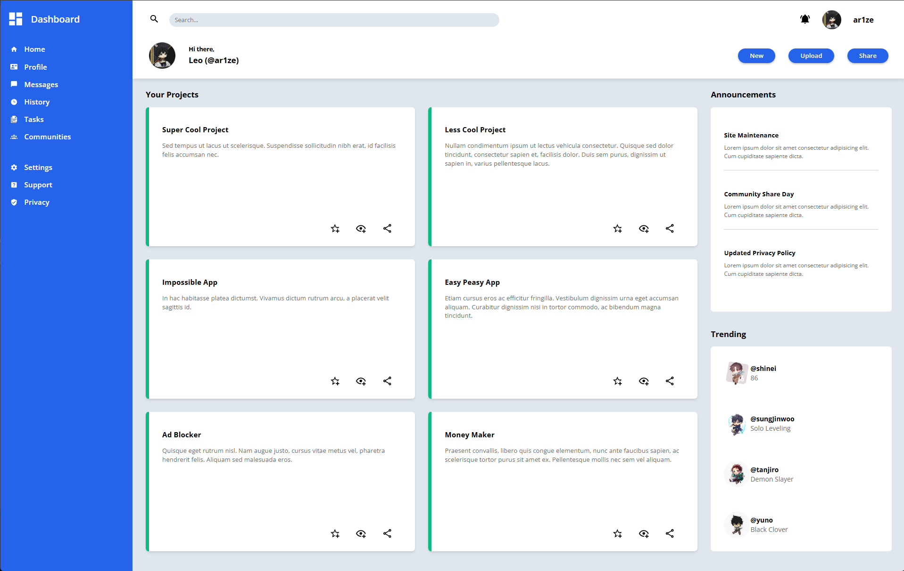

# Admin Dashboard

A responsive admin dashboard layout built with HTML and CSS, focusing on modern layout techniques like CSS Grid and Flexbox. This project is part of [The Odin Project's Intermediate HTML and CSS course](https://www.theodinproject.com/lessons/node-path-intermediate-html-and-css-admin-dashboard).

***

## Screenshot

  

***

## Live Demo
[View the Live Dashboard](https://ar1ze.github.io/admin-dashboard/)

***

## Key Technologies & Concepts
• HTML  
• CSS/SCSS  
• CSS Grid Layout  
• Flexbox  
• Responsive Design  
• BEM Methodology  
• SCSS Variables, Partials & Mixins